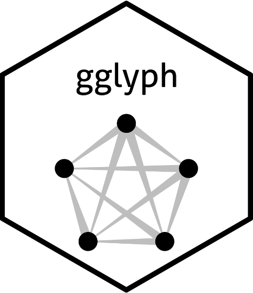

# gglyph  

<!-- badges: start -->
[](https://github.com/valentinsvelev/gglyph)
[](https://lifecycle.r-lib.org/articles/stages.html)
[](https://CRAN.R-project.org/package=gglyph)
[](https://CRAN.R-project.org/package=gglyph)
[](https://github.com/valentinsvelev/gglyph/actions/workflows/R-CMD-check.yaml)
<!-- badges: end -->

**gglyph** provides tools for creating network-style visualizations of directed pairwise relationships using custom edge glyphs built on top of `ggplot2`.

## Installation

You can install the development version from GitHub:

```r
install.packages("devtools")
devtools::install_github("valentinsvelev/gglyph")
```

## Use

You can use the package as follows:

```r
library(gglyph)

ggplot(data = pisa2022_subset) +
  geom_glpyh()
```
